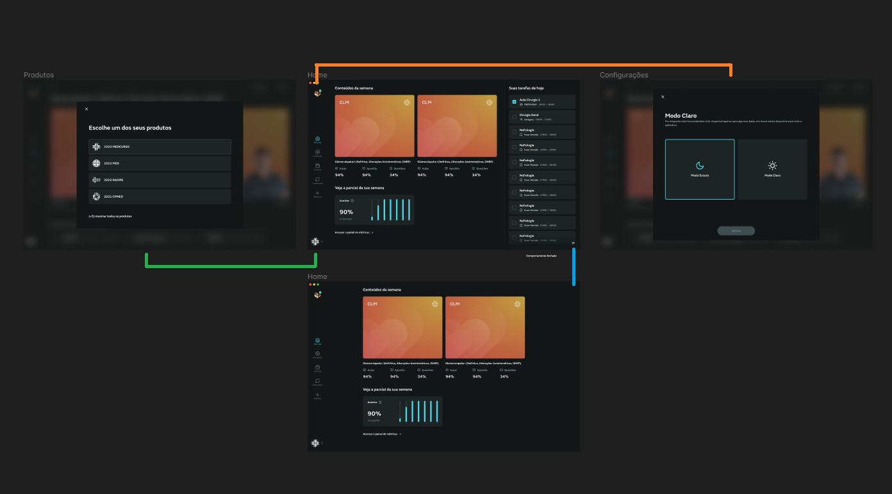

# Teste para candidatos à vaga de desenvolvedor Front-end UI/UX

> [](http://www.medgrupo.com.br)

## Instruções

1. As atividades deverão ser realizadas no prazo estipulado;
2. Implemente o layout com base no figma disponibilizado (utilizar a font-family **open sans**);
3. Faça um fork deste repositório, para poder armazenar sua prova;
4. Após terminar o teste, envie o link do repositório para o email do contato;
5. Caso você não consiga realizar um fork, nos envie o projeto zipado via **[email](email)**;
6. Você não precisa entregar os pontos diferenciais, porém qualquer um entregue, contará pontos.
7. Não Utilizar frameworks CSS!!!

## Estágio:

**[Layout a ser replicado](https://www.figma.com/design/z8XhCwiKDTFnm0d1pc1QWX/Templa%CC%81rios-Test?node-id=0-1&t=Z3h74p0RcSVlESEB-0)**

**Prazo para entrega: 4 dias**

```
- HTML semântico
- Responsividade do layout (Sinta-se a vontade para desenvolver uma solução entre os layouts desktop e mobile apresentados)
- Estilização em CSS
- Acessibilidade
- Separação dos componentes em arquivos CSS utilizando '@import url()'
- Desenvolvimento dos estados dos componentes em JavaScript (navegação extendida e modal)
- Organização

Diferenciais:

- Metodologia BEM
- Estilização em SCSS ou Styled Components
- Animações em CSS (Sinta-se a vontade para criar a sua própria, seguindo as premissas do layout)
- Separação dos componentes em arquivos SCSS ou Styled Components
- Desenvolvimento dos estados dos componentes em TypeScript
- Git/Github
- Comunicação
```

## Júnior:

**[Layout a ser replicado](https://www.figma.com/design/z8XhCwiKDTFnm0d1pc1QWX/Templa%CC%81rios-Test?node-id=0-1&t=Z3h74p0RcSVlESEB-0)**

**Prazo para entrega: 4 dias**

```
- HTML semântico
- Responsividade do layout (Sinta-se a vontade para desenvolver uma solução entre os layouts desktop e mobile apresentados)
- Metodologia BEM
- Estilização em SCSS ou Styled Components
- Animações em CSS (Sinta-se a vontade para criar a sua própria, seguindo as premissas do layout)
- Acessibilidade
- Separação dos componentes em arquivos SCSS ou Styled Components
- Desenvolvimento da aplicação em Angular, utilizando o JSON fornecido
- Git/Github
- Organização
- Comunicação

Diferenciais:

- Animações utilizando as plataformas GreenSock ou Ionic Animations
- Documentação dos componentes em Storybook
```

## Pleno:

**[Layout a ser replicado](https://www.figma.com/design/z8XhCwiKDTFnm0d1pc1QWX/Templa%CC%81rios-Test?node-id=0-1&t=Z3h74p0RcSVlESEB-0)**

**Prazo para entrega: 4 dias**

```
- HTML semântico
- Responsividade do layout (Sinta-se a vontade para desenvolver uma solução entre os layouts desktop e mobile apresentados)
- Metodologia BEM
- Estilização em SCSS ou Styled Components
- Animações em CSS + utilizando as plataformas GreenSock ou Ionic Animations (Sinta-se a vontade para criar a sua própria, seguindo as premissas do layout)
- Acessibilidade
- Desenvolvimento da aplicação em Stencil ou Angular ou React ou Vue ou Ionic ou React Native, utilizando o JSON fornecido
- Documentação dos componentes em Storybook
- Git/Github
- Organização
- Comunicação
```

### Troca de tema

Trocar e salvar as cores dinâmicamente conforme a **[Paleta](https://www.figma.com/design/z8XhCwiKDTFnm0d1pc1QWX/Templa%CC%81rios-Test?node-id=632-1213&p=f&t=rkzRk14ZnVu0YYT9-0)** de cores.

### Arquitetura do projeto

Sinta-se a vontade para definir a arquitetura do projeto.

Pontos a serem validados:

- Organização
- Linting
- Arquitetura SCSS ou Styled Components
- Arquitetura TypeScript

# Sobre o teste

## Fluxos

1. **[Path Verde]** - ao clicar no ícone da tela `home`, deverá ser aberta a modal `Produtos`.
2. **[Path Laranja]** - ao clicar no avatar da tela `home`, deverá ser aberta uma modal com a possibilidade de troca de tema `Configurações`.
3. **[Path Azul]** - ao clicar no botão da tela `home`, a navegação dever ser retraida e extendida.



## Pontos Extras (Estagiário e Júnior)

### Troca de tema

Trocar e salvar as cores dinâmicamente conforme a **[Paleta](https://www.figma.com/design/z8XhCwiKDTFnm0d1pc1QWX/Templa%CC%81rios-Test?node-id=632-1213&p=f&t=rkzRk14ZnVu0YYT9-0)** de cores.

### Arquitetura do projeto

Sinta-se a vontade para definir a arquitetura do projeto.

Pontos a serem validados:

- Organização
- Linting
- Arquitetura CSS ou SCSS ou Styled Components
- Arquitetura JavaScript ou TypeScript

### Boa sorte!
